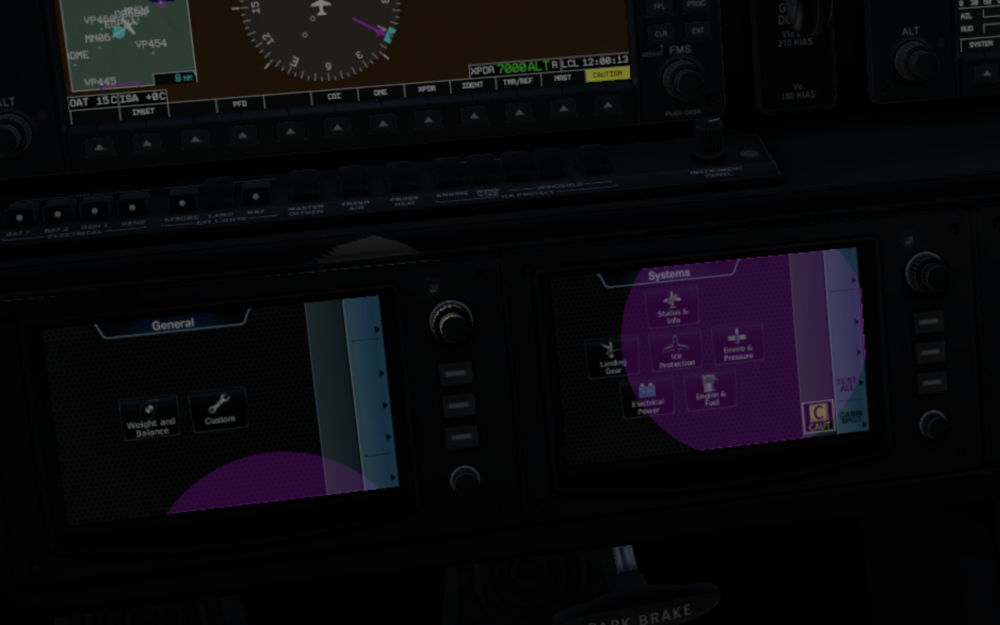

# MT Cairo Render Demo 

This is a barebones plugin that demonstrates how to set up a `mt_cairo_render_t` object (from Saśo Kiselkov's excelent [libacfutils](https://github.com/skiselkov/libacfutils)) to draw on panels or windows using Cairo in a background thread.

## Building

You'll need to have a copy of `libacfutils`. Once you have that somewhere on your machine and built the library, use CMake to generate build files, then `make`.

```
$ mkdir build && cd build
$ cmake .. -DLIBACFUTILS=path/to/your/acfutils/repo
$ cmake
```

The output is the `mtcr_demo` directory, which you can add to the plugins directory of any plane. In the default Cirrus SF50, the gorgeous results are as follows:

